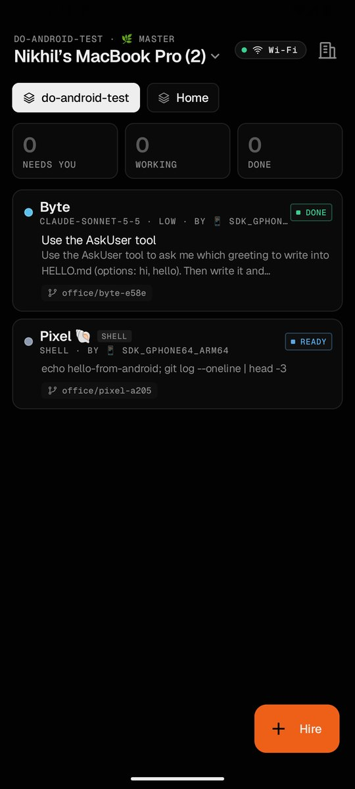
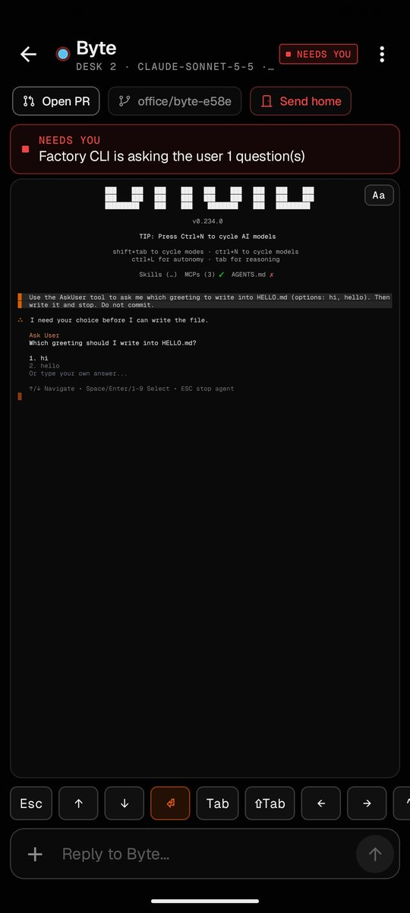
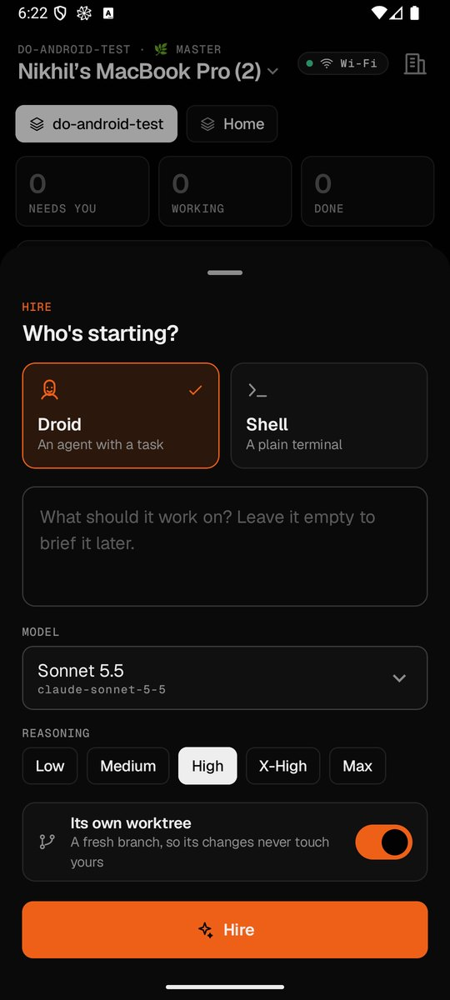
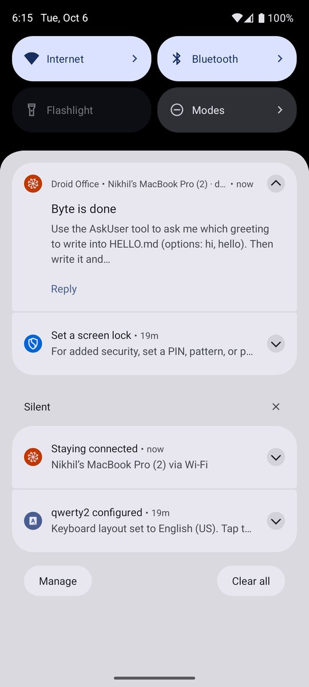
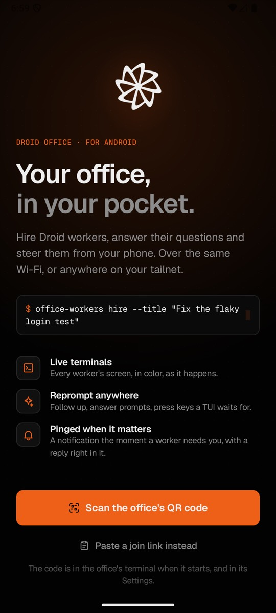
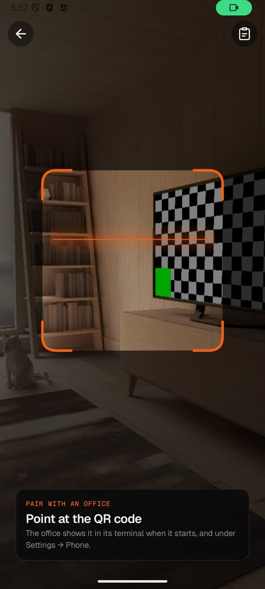
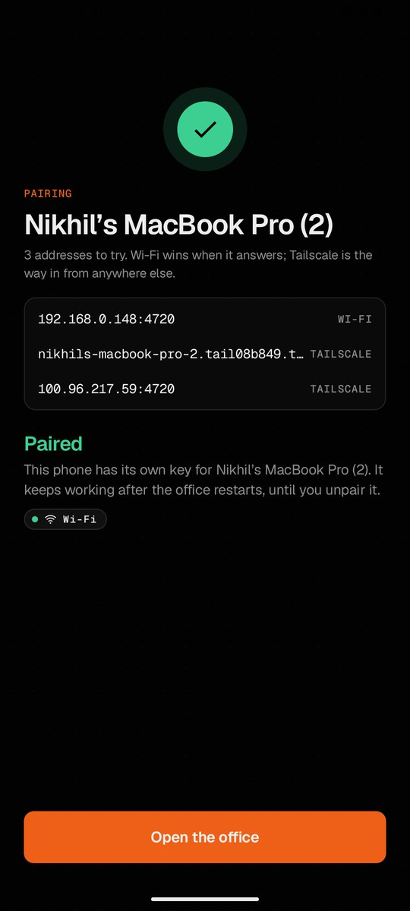
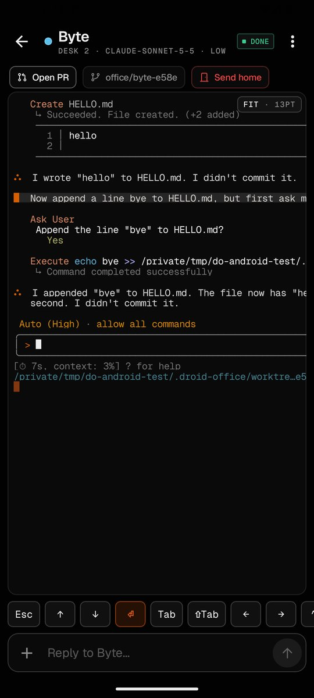
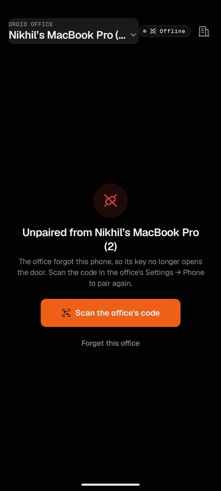

# Droid Office for Android

A companion app for your phone. Pair it with your office once, and from anywhere on your Wi-Fi or your tailnet you can see every worker, hire new ones, watch their live terminals and prompt them.

<p>
  
  
  
  
</p>

## What it does

- **Pair with a QR code.** Open ⚙️ Settings → **Phone** in the office on your computer, choose **📱 Pair a phone** and scan the code. The app also takes the join URL's QR code from the office's terminal, a `droidoffice://pair` link, or a pasted link.
- **Every worker, every floor.** Workers are grouped by floor, the ones that need you first, with what each is doing, its desk and its branch. Pull down to refresh. Subagents sit under their lead.
- **Live terminals.** A worker's real PTY streams in, drawn to fit your screen's width. Pinch to zoom or double-tap (or **Aa** / **Fit** in the quick keys) to switch between fit and zoomed without changing its dimensions. **Phone** instead resizes the actual PTY's columns and rows for readable phone-sized text, so programs wrap and redraw for your screen. It adjusts when you rotate the phone or open the keyboard; tap **Phone** again to return to the previous dimensions unless another window has taken over. The terminal size is shared with the office's desktop views. Scroll to read earlier rows; **Latest** brings you back to what the program last drew. Cells are drawn column by column like the office's own terminal: wide characters and emoji keep their columns, box drawing and block elements join up across rows, and bold is bold.
- **Prompt and type.** The composer sends a prompt to a Droid worker, with up to 10 photos attached. A shell worker gets a single command line. The quick keys under it send Enter, Esc, Tab, the arrows, Ctrl+C and the rest. When a worker shows a numbered menu (AskUser, a folder-trust or permission prompt), its choices appear as buttons above the terminal; tapping one sends the keys that pick it.
- **Hire from your phone.** Pick Droid or Shell, a first prompt, a model (grouped like the office's picker: your models, Factory's, legacy) and reasoning effort, and whether it gets its own git worktree. The sheet starts on the model and effort you hired with last. The office seats it at the first free desk, then the first free bean bag, or puts it on the task queue.
- **Run the floor.** Resume a sleeping worker, ask a worker on a branch to open its pull request (or open the one it has), copy what's on its screen, or send it home (keeping or deleting its worktree and branch).
- **Notifications with replies.** When a worker needs you or finishes, the phone notifies you, and quietly updates the notification when the office fills in what it's asking. Reply from the notification and the reply goes straight to that worker. The app asks for notification permission once, right after pairing; after that, **Allow** under **Offices** opens the system prompt or, once Android stops showing it, the app's notification settings. Turn on **Stay connected** to keep the connection open while the app is in the background; otherwise notifications only arrive while the app is open or shortly after.
- **More than one office.** Pair a laptop and a server and switch between them under **Offices**.
- **Tablets.** On a wide screen the worker list and the terminal sit side by side.

<p>
  
  
  
  
  
</p>

## Install it

You need Android 9 or newer and an office new enough to pair phones (one whose ⚙️ Settings has a **Phone** category).

1. Download `Droid-Office-<version>.apk` from the [latest release](https://github.com/nikships/droid-office/releases/latest) on your phone.
2. Open it and allow your browser or file manager to install apps when Android asks.
3. Open **Droid Office**, tap **Scan the office's QR code**, and scan the code from ⚙️ Settings → **Phone** on your computer.

Each release's APK carries the same version as the office it shipped with. Installing a newer one over the old keeps your paired offices.

## How it connects

- **Wi-Fi first, then Tailscale.** The pairing code lists the office's Wi-Fi addresses, then its Tailscale MagicDNS name and `100.x.y.z` address. Each time it connects, the app asks every address at once and uses the first that answers, but waits a moment (600 ms) for a Wi-Fi address still in flight before settling for Tailscale. It races again whenever the phone's network changes, so walking out of the house moves it to Tailscale on its own. While it is on Tailscale it asks the Wi-Fi addresses again every 30 seconds, and moves back as soon as one answers (after a Wi-Fi blip nothing about the phone's network changes). For Tailscale, sign the phone in to the same tailnet as the office's machine.
- **Device token.** Pairing trades the office's one-time LAN token for a device token of its own (`POST /api/mobile/pair`), so the phone stays paired when the office restarts. Pairing an office the phone is already paired with replaces the old entry and hands the office back the old token, so the office lists the phone once. Pairing runs in the app's scope, so rotating the phone mid-way doesn't pair twice. The app sends it as `Authorization: Bearer` on every request and on the WebSocket. Against an office from before phone pairing, the app falls back to the LAN token in the link, which stops working when that office restarts.
- **Forgetting a phone.** **Forget** next to the phone in the office's Phone window, or **Forget** next to the office under **Offices** in the app, unpairs it. When the office refuses its token (a `401`, or the WebSocket closing with `4401`), the app stops reconnecting and shows **Pair again**.
- **Reconnects.** A dropped connection retries after 1 s, 2 s, 4 s … up to 30 s. The app keeps its connection while it is on screen, while **Stay connected** is on, or while it sends a notification reply, and closes it 20 seconds after the last of those ends.

## Security

- The device token is as good as a shell on the office's machine. The app keeps it encrypted with an AES-256-GCM key in the Android Keystore (hardware backed where the phone has it), and turns off Android's cloud and device-to-device backups, so a new phone pairs again.
- An office serves plain HTTP on its LAN and tailnet addresses, so the app allows cleartext, but only to private addresses: loopback, link-local, RFC 1918, Tailscale's `100.64.0.0/10` and IPv6 unique-local. `net/CleartextGuard.kt` checks the address each connection actually reached, before any of the request is sent. An office on a public address needs HTTPS. Only the system's certificate authorities are trusted.

## Build it

You need JDK 17 or newer (CI uses 21) and the Android SDK with platform 37. Android Studio provides both; on the command line, point `ANDROID_HOME` at the SDK or write `sdk.dir=<path>` to `android/local.properties`.

Run from `android/`:

| Task | Command |
| --- | --- |
| Unit tests | `./gradlew testDebugUnitTest` |
| Lint (any error fails) | `./gradlew lintDebug` |
| Debug APK (`ai.factory.droidoffice.debug`, installs next to a release build) | `./gradlew assembleDebug` |
| Install the debug APK on a connected phone or emulator | `./gradlew installDebug` |
| Release APK, minified with R8 | `./gradlew assembleRelease` |

The release APK is signed with the keystore in `ANDROID_KEYSTORE_FILE`, `ANDROID_KEYSTORE_PASSWORD`, `ANDROID_KEY_ALIAS` and `ANDROID_KEY_PASSWORD` when they are set, and otherwise with the machine's debug key (`~/.android/debug.keystore`, which the Android build creates the first time it needs one). A debug-signed APK installs, but Android only updates an app with an APK signed by the same key. `-PofficeVersion=0.1.123 -PofficeVersionCode=123` sets its version.

To try it against a local office from an emulator, start the office (`node bin/droid-office.js <project>`), open ⚙️ Settings → **Phone**, and pass the link to the emulator; `10.0.2.2` is the host machine:

```bash
adb shell "am start -a android.intent.action.VIEW -d 'droidoffice://pair?v=1&name=My%20Mac&t=<token>&u=http://10.0.2.2:4600'"
```

## Drive it with adb

Every screen and control has a stable name from [`core/Tags.kt`](app/src/main/java/ai/factory/droidoffice/core/Tags.kt), which `uiautomator dump` prints as the node's `resource-id`. An agent can see where the app is and tap a control by name instead of by its text or position:

```bash
# What's on screen: each tagged node with its text and bounds.
adb exec-out uiautomator dump /dev/tty | sed 's/<node /\n<node /g' | grep 'resource-id="[^"]'

# Tap a control: take the centre of its bounds="[l,t][r,b]".
adb shell input tap 672 2577
```

- **Where you are.** The screen's root is one of `screen.welcome`, `screen.scan`, `screen.pair`, `screen.home`, `screen.worker` or `screen.offices`. A sheet or dialog adds its own root: `hire.sheet`, `hire.model_sheet`, `paste.sheet`, `send_home.dialog` or `forget.dialog`.
- **Dynamic names.** A name with an id in it has the id after a `/`: `home.worker/<workerId>`, `home.floor/<floorId>`, `hire.model/<modelId>`, `hire.effort/<effort>`, `worker.choice/<number>`, `send_home.option/all|worktree|keep`, `offices.office/<officeId>`, `offices.forget/<officeId>` and `composer.remove_image/<n>`.
- **Home.** Each worker card is `home.worker/<id>`. Inside it are `home.worker.name`, `home.worker.status` (its content-desc is the status: "Needs you", "Working", "Ready", "Done", "Asleep"), `home.worker.meta`, `home.worker.title` and `home.worker.detail`. The other names on this screen are `home.hire`, `home.hire_first` (on an empty floor), `home.list` (swipe it to scroll), `home.loading`, `home.route` (content-desc "Connected over Wi-Fi" and so on), `home.connection`, `home.retry`, `home.pair_again`, `home.settings`, `home.offices`, and `home.stat.needs_you`, `home.stat.working` and `home.stat.done` (content-desc "Needs you: 2").
- **A worker.** `worker.terminal` has the whole terminal screen as its `text` attribute, so a dump reads it without a screenshot. `worker.status`, `worker.name` and `worker.meta` describe the worker. `worker.needs_you` and `worker.question` show what it is waiting on, and `worker.choice/<n>` buttons answer a numbered menu. Type with `composer.input` (tap it, then `adb shell input text`) and send with `composer.send`. The quick keys are `key.` plus what TalkBack says, with spaces turned into underscores: `key.escape`, `key.up`, `key.down`, `key.enter`, `key.tab`, `key.shift_tab`, `key.left`, `key.right`, `key.control_c`, `key.backspace`, `key.1`, `key.2`, `key.3`, `key.y`, `key.n` and `key.zoom`. `key.phone` is `checked` when Phone mode is on and resizes the actual terminal rather than zooming it. Also here: `worker.back`, `worker.menu` (`worker.menu.copy`, `worker.menu.send_home`), `worker.resume`, `worker.pr`, `worker.branch`, `worker.send_home`, `worker.latest`, `worker.asleep`, `worker.asleep.resume`, `worker.cloud` (a cloud worker, which has no terminal here), `worker.offline`, `worker.gone` and `composer.attach`.
- **Hiring.** `hire.droid` and `hire.shell`, the `hire.effort/<effort>` chips and the `hire.model/<id>` rows in the model sheet are `checked` when chosen, and so are `home.floor/<id>` chips and `send_home.option/<cleanup>`. `hire.worktree` is `checked` when on. The rest are `hire.prompt`, `hire.model`, `hire.submit` and `hire.queue`.
- **Settings.** `settings.stay_connected`, `settings.notify_needs_input`, `settings.notify_done` and `settings.haptics` are rows reported as `checked` when on; tap one to flip it. The other names here are `offices.back`, `offices.pair_new` and `offices.allow_notifications`, plus `forget.confirm` and `forget.cancel` in the forget dialog.
- **Pairing.** `welcome.scan`, `welcome.paste`, `scan.paste`, `scan.camera`, `paste.input`, `paste.submit`, `pair.status` ("PAIRING", "PAIRED", "NOT PAIRED"), `pair.outcome`, `pair.open`, `pair.retry` and `pair.cancel`.
- **Anywhere.** `app.banner` (tap to open the worker), `app.banner.dismiss` and `app.snackbar`.

Skip the taps where an intent does the job. The activity takes a pairing link, and it opens a worker or a floor by id (the ids are in the names above):

```bash
adb shell "am start -a android.intent.action.VIEW -d 'droidoffice://pair?v=1&name=My%20Mac&t=<token>&u=http://192.168.1.20:4600'"
adb shell am start -n ai.factory.droidoffice/.MainActivity -a ai.factory.droidoffice.OPEN_WORKER --es office <officeId> --es worker <workerId>
adb shell am start -n ai.factory.droidoffice/.MainActivity -a ai.factory.droidoffice.OPEN_FLOOR --es office <officeId> --es floor <floorId>
```

The debug build's package is `ai.factory.droidoffice.debug`, and its activity is still `ai.factory.droidoffice.MainActivity`. While a worker's terminal is changing, Android may not find the screen idle long enough for a dump. Retry once the terminal settles, or dump from the home screen.

## In CI

The `android` job in [`.github/workflows/release.yml`](../.github/workflows/release.yml) runs the unit tests and lint, builds the release APK with the office's release version, and uploads it as the `android` artifact. On `main`, the publish job attaches it to the GitHub release next to the Mac app.

**Signing.** Releases are signed with the Droid Office Android release key, so each one installs over the last and keeps your paired offices. The job reads it from four repository secrets on `nikships/droid-office`: `ANDROID_KEYSTORE_BASE64` (the JKS keystore, base64), `ANDROID_KEYSTORE_PASSWORD`, `ANDROID_KEY_ALIAS` (`droid-office-android-release`) and `ANDROID_KEY_PASSWORD`. It decodes the keystore into the runner's temporary folder for the build, deletes it afterwards, and prints the APK's certificate in the log. It fails if the secrets were given but the APK still came out debug-signed. Check a downloaded APK with `apksigner verify --print-certs Droid-Office-<version>.apk`. The certificate is `CN=Droid Office Android, O=Droid Office, C=US`, with SHA-256 fingerprint:

```text
16:31:C7:B2:AA:27:08:2B:77:85:50:A0:CB:28:94:56:6D:D1:2F:5C:B2:45:7D:A2:11:E9:7A:79:65:DE:FB:21
```

A pull request from a fork gets no secrets. Its APK is signed with a debug key the runner creates, a new one every run. That APK installs on a phone without the app, but Android refuses it over a release (`INSTALL_FAILED_UPDATE_INCOMPATIBLE`), so uninstall first to try it, which forgets the paired offices.

The keystore and its passwords are kept outside the repository by the maintainer. GitHub secrets can't be read back, and an APK signed with any other key can never update an installed release, so the keystore file is the one thing that must not be lost. To sign a release build locally with it, export the four `ANDROID_KEYSTORE_FILE`, `ANDROID_KEYSTORE_PASSWORD`, `ANDROID_KEY_ALIAS` and `ANDROID_KEY_PASSWORD` variables before `./gradlew assembleRelease`.

## Project layout

| Path | Contents |
| --- | --- |
| `app/src/main/java/ai/factory/droidoffice/core/` | Pure Kotlin, no Android: the pairing link parser, route kinds and the route race, the WebSocket protocol, the terminal screen model and cell layout (character widths, box glyphs, numbered menus), worker grouping, labels and model names |
| `data/` | Paired offices and settings (DataStore) and the Keystore token vault |
| `net/` | The HTTP API (OkHttp), the cleartext guard and the network monitor |
| `session/` | `OfficeConnection`, the one connection to the current office (route race, WebSocket, reconnects, who holds it open), and `Pairer` |
| `notify/` | Notifications, direct replies and the Stay connected foreground service |
| `ui/` | Compose screens: `onboarding/`, `home/`, `worker/`, `offices/`, plus the theme and shared components |
| `app/src/test/` | JUnit tests for `core/` |
| `docs/` | The screenshots on this page |
