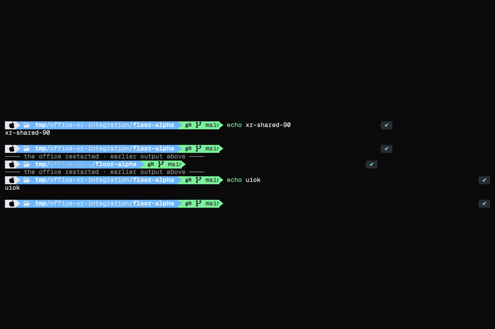
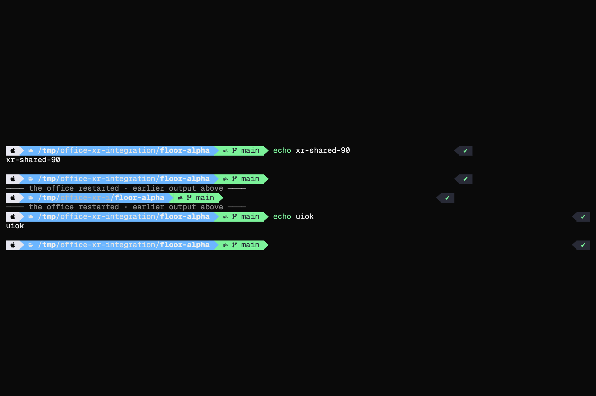

# Terminal glyph correction, 2026-09-30

Terminal screenshots showed a clipped `git` icon and crowded prompt text on the
original laptop screen. A browser replay reproduced the font-metric mismatch.

Geist Mono advances each text cell by 0.6em. The former bundled symbols font
advances its Nerd Font icons by 1em, with outlines that can also occupy 1em.
At 20 px this is 12 px versus 20 px. xterm's next colored cell covered the end
of U+F1D3 (`git`), and canvas `fillText` runs drifted beyond their cell-counted
backgrounds. Replaying the extracted grid reproduced `main` appearing as `mair`.

The replacement **Droid Office Terminal Symbols** is an OFL derivative with
600-unit advances in a 1000-unit em. Ordinary icons scale uniformly only when
their outlines need to fit, and are centered in the cell; narrow icons retain
their height. Powerline separators retain their height and meet both horizontal
cell edges. Its new family and URL identify the modified font. The source
copyright metadata and bundled OFL notice remain. Regular and bold terminal text
use the same icon outlines, avoiding synthetic bold extending beyond the cell.
Both xterm and the original laptop painter retain their shared `TERM_FONT` stack.

Terminals now open after the shared font load settles, so xterm's first cached
measurements use the loaded faces. Canvas laptops repaint once after that load,
including an idle PTY. A failed unrelated face no longer finishes the font-load
callback before the remaining icon requests settle.

These are browser replays of the captured terminal grid, using the original
laptop painter at its original canvas size.

Before:



After:



## Validation

- The emitted WOFF2 was reopened and checked: all 7,595 mapped icons have a
  0.6em advance, all outlines fit horizontally, and every separator meets both
  cell edges. A second pinned rebuild produced identical bytes.
- Browser canvas checks covered the actual prompt's U+F179, U+F115, U+F1D3,
  U+F126, U+E0B0 and U+E0B2, plus BMP and supplementary devicons. All 112
  checks passed at 10, 14, 16, 20, 25.9307, 30 and 36 px, in regular and bold.
  Mixed icon/text runs advanced by their intended cell count.
- The real terminal UI passed 14 px and 20 px browser
  fixtures. A delayed font load, closing before completion and reopening left
  only one terminal and one attach. These fixtures used a local message stub;
  they did not connect to or type into workers.
- The idle-laptop regression covers a failed prose face while the other fonts
  are pending, completion without another PTY frame, shared loading, and no
  continuous repaint afterward.
- Node 22 lint, typecheck and all 642 coverage tests passed (84.55% lines,
  80.67% functions). The client/server build includes the replacement asset.

Symbols outside the bundled ranges
still use the existing system fallbacks; this change does not replace the
existing Unicode/grapheme handling for other scripts.

## Rebuild the font

The input is the formerly bundled Nerd Fonts 3.4.0 subset from commit `2df9683`,
derived from `NerdFontsSymbolsOnly.zip`. Its SHA256 is
`dd8e4fa2ed0d55d24475b7ab618eb5f814349d0ad82423bd1256bb6c45e647e0`.
The builder verifies that input, renames the derivative and validates the output.
No Python dependency is needed to build or run the office.

```bash
git show 2df9683:src/client/public/fonts/SymbolsNerdFontMono-Regular.woff2 > /tmp/office-symbols-source.woff2
uv run --with fonttools==4.66.1 --with brotli==1.2.0 python tools/terminal-symbols.py /tmp/office-symbols-source.woff2 src/client/public/fonts/DroidOfficeTerminalSymbols-Regular.woff2
```

The output SHA256 is
`6bd53aae55b56dc0187664cfef607fa4abd3a08bfa3aad5e19810381bc94bbfb`.
